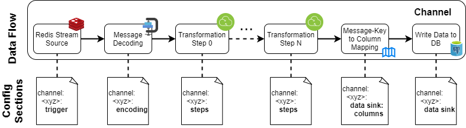

# RedSQL Data Sync
Generic Redis to SQL data synchronizer. 

To flexibly configure the operation of RedSQL independent of the Redis format, a
series of transformation steps can be defined. Each step transforms the input messages into another series of output 
messages that can be picked up by the next step or fed into the database.
The overall data flow is illustrated in the following graphics. Note that some intermediate steps such as individual
transformation steps may be omitted, in case messages are already received in an adequate format. 
 

## Installation (User Setup)
Although RedSQL can also be installed via pip and accessed via the `redsql` commandline tool, it is recommended to use
the provided container images via (Docker, Podman, ...). Pre-build images are hosted on the 
[GILTab container registry](https://gitlab-intern.ait.ac.at/ees/rdp/generic-components/redsql/container_registry). Make
sure that your Docker or Podman instance is properly authenticated. The main configuration file is expected at 
`/etc/redsql/config.yml`.

```shell
podman login --username $GITLAB_USER --password $GITLAB_DEPLOYMENT_TOKEN gitlab-intern.ait.ac.at:5010
podman run -v data/test/extensive-config.yml:/etc/redsql/config.yml \
    gitlab-intern.ait.ac.at:5010/ees/rdp/generic-components/redsql
```

The `gitlab-intern.ait.ac.at:5010/ees/rdp/generic-components/redsql` container defines the following tags:
* `latest`: The latest release. Currently, the latest tag mirrors the state of the main branch.
* `latest-dev`: The latest development snapshot as given in the development branch
* `v<major>.<minor>.<patch>`: Versioned releases as defined by the corresponding git tags.


## Installation (Development Setup)
The development packages can be found in the conda environment definition: 
```shell
conda env create -f environment.yml
conda activate redsql
```

For development and testing, RedSQL requires a Redis and PostgreSQL instance best provided via containers. To configure
the containers, an environment file can be used:  
```shell
POSTGRES_DB=postgres
POSTGRES_USER=postgres
POSTGRES_HOST=localhost
POSTGRES_PASSWORD=<some-pwd>

REDSQL_REDIS_HOST=localhost
REDSQL_REDIS_PORT=6379
REDSQL_REDIS_DB=0
```
The containers can then be started with:
```shell
podman run --env-file=.env -p 5432:5432 -v redsql-timescale-dev:/var/lib/postgresql/data -it -d \
    docker.io/timescale/timescaledb:latest-pg14
podman run -p 6379:6379 -it -d docker.io/redis
```

To run the test suite, make sure that both the content root and the test directory are within the python path. The 
connection to the Redis and PostgreSQL instance is given via environment variables and default assignments:
```commandline
set PYTHONPATH=.;.\test
set REDSQL_DB_URL=postgresql://postgres:<some-pwd>@localhost:5432/postgres

pytest test
```

## Configuration
### Basic Input-Output Mapping
The configuration is read from a YAML file passed on to the `redsql` executable. An exemplary configuration can be found
in [the test data direcotry](data/test/extensive-config.yml). The `database connection` and `redis` statements globally
define the connection parameters to the data sink and source, respectively. External environment variables can be
referenced by `!env-template` expressions. E.g.:

```yaml
# The connection URL to the SQL data sink:
database connection: !env-template "postgresql://${POSTGRES_USER}:${POSTGRES_PASSWORD}@${POSTGRES_HOST}/${POSTGRES_DB}"
redis:
  host: !env-template "${REDSQL_REDIS_HOST}"  # The Redis hostname or IP address. Default is localhost
  port: !env-template "${REDSQL_REDIS_PORT}"  # The Redis port. Default is 6379
  db: !env-template "${REDSQL_REDIS_DB}"  # The Redis database ID. Default is 0
```

By the `channels` configuration key, a named list of synchronisation relations that read from a specific stream, 
transform the messages and write it into the database is given. A minimal channel definition can be configured by a 
`trigger` section defining the redis stream to fetch the messages from and a `data sink` section that defines the 
destination table:
```yaml
channels:  # The named list of synchronisation relations
  forecasts_weather:  # An arbitrary name that is mostly used for debugging and logging purposes
    trigger:  # Definitions on how to fetch data and trigger the channel execution
      stream id: "forecasts.weather"  # The ID of the Redis stream to fetch messages from
    data sink:
      table: "forecasts"  # The name of the database table to write the message content to
```

Without any further configuration, for each column, a message entry must be present. To map column names and message 
keys that do not match, a `columns` clause can be appended to the `data sink` configuration. In case one column is not 
listed in the `columns` section, a one-to-one mapping is assumed. 
```yaml
channels:
  forecasts_weather:
    trigger:
      stream id: "forecasts.weather"
    
    data sink:
      table: "forecasts"
      columns:  
        # Defines the message keys for each column name. Per default, the same name will be assumed.
        # Format: <column name>: <message key>
        obs_time: "observation_time"
        fc_time: "forecast_time"
```

### Message Encoding
Since Redis does not specify value encodings beyond strings, an `encoding` clause can be appended to the channel
definitions. The clause itself defines a mapping of message keys to the expected encoding. In addition, a `_default` 
key can be specified defining the encoding, if no further configuration is given for a particular key.
```yaml
channels:
  forecasts_weather:
    trigger:
      stream id: "forecasts.weather"
    
    encoding:  # Defines the message encoding
      _default: "JSON"  # The default encoding (JSON content)
      fc_time: "JSONDatetimeString"  # Expect a single JSON string with ISO datetime   
      obs_time: "JSONListWithDatetimeStrings"  # Expect a JSON list with ISO datetime strings
    
    data sink:
      table: "forecasts"
```

Currently, the following encodings are supported:
* `KeepEncoding`: Do not change the encoding given by Redis
* `DatetimeString`: An ISO-formatted Datetime string without enclosing it in quotation marks as required by JSON
* `JSON`: Directly decode the contents as JSON
* `JSONListWithDatetimeStrings`: Assume an JSON array with ISO-formatted datetime strings is given.
* `JSONDatetimeString`: Assume the JSON strings is an ISO-formatted datetime

### Trim Redis Streams
To avoid excessive memory usage of Redis streams, RedSQL may issue periodic trim operations. Within the `trigger` 
configuration, a `trim length` parameters can be set to enable trimming and cut the stream to the given value. In case 
trimming should be avoided, the parameter can be set to `None` (default). Note that for performance reasons, it is 
currently not checked before trimming whether all messages have been consumed. Hence, setting the maximum length too 
small may result in data loss. Additionally, approximate trimming is enabled, that permits size overshoot to further 
improve the performance. The following example limits the number of messages within the redis stream to about 200:

```yaml
channels:
  forecasts_weather:
    trigger:
      stream id: "forecasts.weather"
      trim length: 200  # Redis stream trimming target
    data sink:
      table: "forecasts"
```

### Transformation Steps
Transformation rules can be defined to change the message format of the incoming messages to a format understood by the
database. They are defined by a series of sequentially applied steps that transform the input message(s) to a series 
of output messages. The individual steps are defined in the `steps` configuration clause that itself host a list of 
individual step definitions: 
```yaml
channels:
  forecasts_weather:
    trigger:
      stream id: "forecasts.weather"
    
    steps:  # The sequence of steps to apply to each input message
      - type: "SplitByKey"  # The type of the individual step
        destination key: "value"  # step-specific configuration
    
    data sink:
      table: "forecasts"
```

#### Split the Message by Message Keys
The `SplitByKey` step generates a new message for each key in the input message. In addition, the original key is 
renamed to the key name given in `destination key`. Optionally, the original key string can be stored in a new key 
specified by `source output key`. Keys from the input message that should be copied to all output messages can be
specified by the `always include` parameter:

```yaml
channels:
  forecasts_weather:
    trigger:
      stream id: "forecasts.weather"
    
    steps:  
      - type: "SplitByKey"
        always include: ["fc_time", "obs_time"]  # Copy fc_time and obs_time to each output message
        destination key: "value"  # Store the value of each key to a key named "value"
        source output key: "observation_type"  # Store the original key name to a new key named "observation_type"
    
    data sink:
      table: "forecasts"
```

The configuration above transforms the single input message
```json
[
  {
    "fc_time": "2022-08-10T10:00:00Z",
    "obs_time": "2022-08-10T11:00:00Z",
    "air_temperature_2m": 22.1,
    "wind_speed_10m": 3.6
  }
]
```
into the following output messages:
```json
[
  {
    "fc_time": "2022-08-10T10:00:00Z",
    "obs_time": "2022-08-10T11:00:00Z",
    "value": 22.1,
    "observation_type": "air_temperature_2m"
  },
  {
    "fc_time": "2022-08-10T10:00:00Z",
    "obs_time": "2022-08-10T11:00:00Z",
    "value": 3.6,
    "observation_type": "wind_speed_10m"
  }
]
```

#### Split Arrays into Multiple Messages
The `UnpackArrayValues` step can be applied to split equally sized arrays into multiple messages, one per index. The
names of the message keys specifying the unpacked arrays will not be changed. The message keys of the arrays can be 
specified by the `unpack keys` configuration:

```yaml
channels:
  forecasts_weather:
    trigger:
      stream id: "forecasts.weather"
    
    steps:  
      - type: "UnpackArrayValues"  # Move each array element into a dedicated message
        unpack keys: ["obs_time", "value"]  # The names of the arrays to unpack
    
    data sink:
      table: "forecasts"
```

For instance, the following input message
```json
[
  {
    "fc_time": "2022-08-10T10:00:00Z",
    "obs_time": ["2022-08-10T11:00:00Z", "2022-08-10T12:00:00Z"],
    "value": [22.1, 23.2]
  }
]
```
is transformed into two output messages:
```json
[
  {
    "fc_time": "2022-08-10T10:00:00Z",
    "obs_time": "2022-08-10T11:00:00Z",
    "value": 22.1
  },
  {
    "fc_time": "2022-08-10T10:00:00Z",
    "obs_time": "2022-08-10T12:00:00Z",
    "value": 23.2
  }
]
```

#### Query External Data
The step `CachedSQLQuery` can be used to extend each message by meta-information queried from the main database. The 
`query` configuration specifies the SQL query to run for each message. Values from the message can be referenced by SQL
parameters, e.g. `:key_name`. The key names that will be appended to each message are determined by the column names of
the returned table. Per default, it is assumed that only a single row is returned that directly defines the message 
keys. In case the `single value` configuration parameter is set to `False`, multiple rows can be returned as column 
arrays.

To avoid excessive queries, a caching mechanism is implemented that stores previous results. The output of each query 
needs to be determined by a list of `cache keys`. Each cache key specifies the name of a message key. In case a query 
was already executed with the same cache key assignment, the result is immediately returned without executing the query 
again. For instance, the following configuration extends the message by a `dp_id` parameter that is generated from the 
values of a `station`, `data_provider`, and `observation_type` field in the input message:

```yaml
channels:
  forecasts_weather:
    trigger:
      stream id: "forecasts.weather"
    
    steps:  
      - type: "CachedSQLQuery"  # Execute an SQL query and extend the message by its results
        # The SQL query to execute:
        query: "
            SELECT id AS dp_id FROM data_points 
              WHERE name=:observation_type AND data_provider=:data_provider AND location_code=:station
          "
        single value: True  # Expect a single value per column only, e.g.  {"dp_id": 42} 
        cache keys: ["station", "data_provider", "observation_type"]  # The listed message keys determine the result
    
    data sink:
      table: "forecasts"
```
